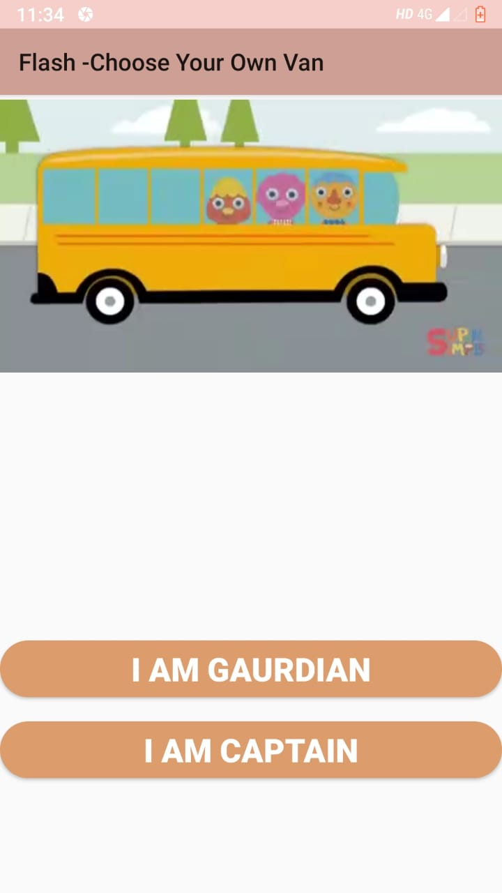

# Flash
This is Android Application . Flash is a School Transport Tracking System to facilitate parents to track the vehicle and also ensure the security by letting them check if their child is there in the van or not.,there are many more features in it.

